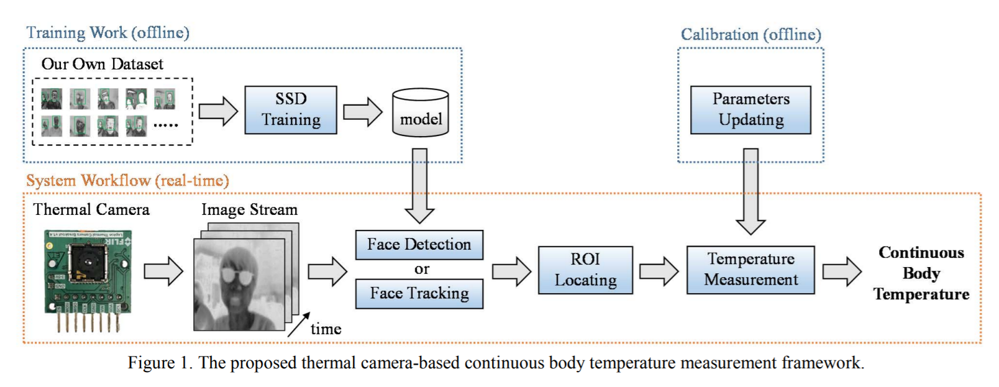

- 기존 온도 교정기
[Temperature Calibration](https://blog.beamex.com/how-to-calibrate-temperature-sensors, "temperature calibration")

keywords: calibration, forehead temperatures, thermometer, infrared, 

- 기존 IR thermometer 흐름

