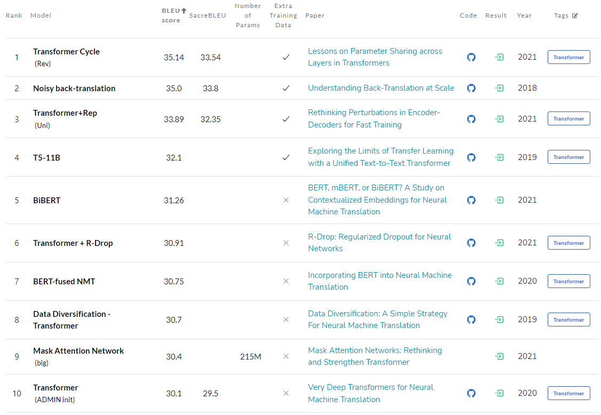

# 공부한 내용 및 참고 자료 정리

## 1. 사용 가능한 오픈 소스 데이터
- WMT2014 English-German data
    - Link: 
[Leaderboard link](https://paperswithcode.com/sota/machine-translation-on-wmt2014-english-german, "leaderboard link")

## 2. 활용 라이브러리
- spaCy : [spaCy link](https://spacy.io/models/, "spacy link")

